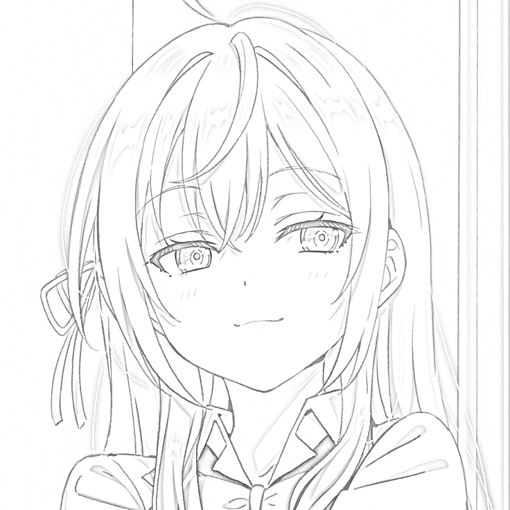

# Image Sketching with Python

This project uses Python, OpenCV, and Matplotlib to transform an image into a sketch-like effect. It processes the input image through a series of transformations, including grayscale conversion, inversion, Gaussian smoothing, and blending, to produce a visually appealing sketch.

---

## Overview

The script performs the following steps:

1. **Load the Image**:
   - Reads the image from the specified file path and converts it to RGB format for display.

2. **Convert to Grayscale**:
   - Transforms the image into a grayscale format to reduce color complexity.

3. **Invert the Grayscale Image**:
   - Produces a negative image to enhance sketch effect creation.

4. **Smooth the Image**:
   - Applies a Gaussian blur to the inverted grayscale image, softening it for a better sketch output.

5. **Create the Sketch Effect**:
   - Combines the grayscale and smoothed images to generate the final sketch using a divide blend technique.

6. **Save the Final Sketch**:
   - Saves the resulting sketch to the specified output path.

---

## Installation

### Prerequisites
Ensure you have Python 3.7 or higher installed.

Install the required libraries using pip:
```bash
pip install opencv-python matplotlib
```

---

## Usage

### Input Image
Place the image you want to process in the same directory as the script or specify the full path in the script.

### Running the Script
1. Clone the repository or download the script.
2. Update the `filepath` in the `main()` function to point to your input image:
   ```python
   filepath = 'your_image.jpeg'
   ```
3. Run the script:
    ```
   python main.py
   ```
4. The final sketch image will be saved as test_coloring.jpeg in the same directory.

---

## Example Workflow

### Input Image
*Include an example input image here if applicable.*

### Processed Steps
1. **Grayscale Image**:  
   Converts the image to grayscale for simplicity and preparation for sketch effect.

2. **Inverted Image**:  
   Inverts the grayscale image to enhance the highlights and shadows.

3. **Smoothened Image**:  
   Applies a Gaussian blur to soften details.

4. **Final Sketch**:  
   Combines the grayscale and smoothened images for a refined sketch.

### Output Sketch
*Include an example output sketch here if applicable.*

---

## Script Details

### Key Functions

- **`load_and_convert_image(filepath)`**:  
  Loads the image from the given file path and converts it to RGB.

- **`display_image(image, title, cmap=None)`**:  
  Displays the image with an optional colormap.

- **`save_image(image, output_path)`**:  
  Saves the processed image to the specified file path.

- **`process_image(filepath, output_path)`**:  
  Orchestrates the entire process: loading, processing, and saving the image.

---

## Output Example

### Final Sketch Output

